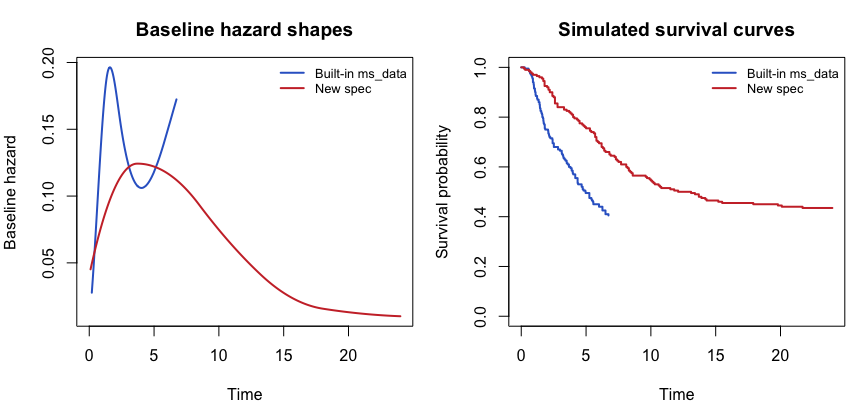

# Simulating flexible survival hazards with M-splines in `simtte`
Carlos Traynor
2026-07-14

## Why M-splines, and why should you care?

If you simulate survival data for a living — clinical trial design,
health economics models, methods research — you’ve probably reached for
the Weibull distribution more times than you can count. It’s a great
default: two parameters, a closed-form hazard, done. But real hazards
are rarely that tidy. Post-surgical risk that spikes early and fades.
Cancer recurrence risk that rises, plateaus, then declines. Multi-modal
hazards from mixed patient populations. A single Weibull shape parameter
simply can’t reproduce these patterns.

This is where **M-splines** come in. An M-spline is a set of smooth,
*non-negative* basis functions built from piecewise polynomials joined
at “knots.” Because each basis function is non-negative everywhere, any
non-negative linear combination of them is guaranteed to be non-negative
too — which is exactly the property you need to represent a baseline
*hazard* function (hazards can’t go negative). Add enough basis
functions and place your knots thoughtfully, and you can approximate
almost any hazard shape you like, without committing to a rigid
parametric form. This is the same idea behind the flexible parametric
survival models of Royston & Parmar (2002).

`simtte` bakes this in: give it a spline basis matrix and a coefficient
vector, and it will treat their product as your baseline hazard,
simulate the implied cumulative hazard via `mrgsolve`, and draw event
times by inverse transform sampling (Bender et al., 2005). The package
ships one example M-spline specification (`ms_data`) so you can try the
machinery immediately — but it’s just *one* hazard shape among
infinitely many you could build. Below, we build a different one from
scratch.

## A quick look at the built-in example

`simtte`’s bundled `ms_data` dataset is a list with four pieces:

``` r
library(simtte)
library(splines2)
library(survival)

set.seed(20260714)
```

``` r
data("ms_data")
str(ms_data)
```

    List of 4
     $ coefs: Named num [1:6] 0.00191 0.02827 0.4586 0.0501 0.21168 ...
      ..- attr(*, "names")= chr [1:6] "m-splines-coef1" "m-splines-coef2" "m-splines-coef3" "m-splines-coef4" ...
     $ mu   : Named num 0.0924
      ..- attr(*, "names")= chr "(Intercept)"
     $ time : num [1:299] 0.197 0.268 0.31 0.329 0.438 ...
     $ basis: 'matrix' num [1:299, 1:6] 1.83 1.52 1.35 1.28 0.92 ...
      ..- attr(*, "degree")= int 3
      ..- attr(*, "knots")= Named num [1:2] 1.38 2.39
      .. ..- attr(*, "names")= chr [1:2] "33.33333%" "66.66667%"
      ..- attr(*, "Boundary.knots")= num [1:2] 0 7.28
      ..- attr(*, "intercept")= logi TRUE
      ..- attr(*, "x")= num [1:299] 0.197 0.268 0.31 0.329 0.438 ...
      ..- attr(*, "dimnames")=List of 2
      .. ..$ : NULL
      .. ..$ : chr [1:6] "1" "2" "3" "4" ...
      ..- attr(*, "derivs")= int 0

`basis` is a 299 × 6 matrix — one row per time point, one column per
spline basis function — built with a **cubic (degree 3)** M-spline over
a `0`–`7.3` time horizon. Multiply `basis %*% coefs` and you get the
baseline hazard at each time point. That’s the entire recipe.

## Building a new M-spline hazard from scratch

Let’s design a hazard with a different flavor: instead of a short,
sharply-peaked risk window, imagine a 24-month oncology follow-up where
risk climbs gradually, plateaus for a while, and then tails off slowly —
a broader, gentler hump spread over a much longer horizon. We’ll also
use a **quadratic** (degree 2) spline with **7** basis functions instead
of 6, just to show the specification is entirely up to you.

The basis matrix itself is built with `splines2::mSpline()` — the same
function used to construct the package’s built-in `ms_data$basis` (you
can confirm this yourself: the `basis` attributes on `ms_data$basis`
record `degree`, `knots`, and `Boundary.knots`, and calling `mSpline()`
with those exact values reproduces it to floating-point precision).
`simtte` doesn’t ship a basis-building helper itself — it expects you to
bring your own basis matrix, however you construct it, and just hands
back a hazard shaped by whatever coefficients you multiply it by.

``` r
## ---- New M-spline baseline hazard spec ----
time_new     <- seq(0.1, 24, by = 0.1)                     # 24-month horizon
knots_new    <- quantile(time_new, probs = c(0.15, 0.35, 0.55, 0.75))
boundary_new <- c(0, 24)

basis_new <- mSpline(
  time_new,
  knots          = knots_new,
  Boundary.knots = boundary_new,
  degree         = 2,             # quadratic, vs. cubic (degree 3) in ms_data
  intercept      = TRUE
)
coefs_new <- c(0.05, 0.35, 0.55, 0.30, 0.10, 0.04, 0.02)   # 7 basis functions, vs. 6
mu_new    <- -0.5

stopifnot(ncol(basis_new) == length(coefs_new))
dim(basis_new)
```

    [1] 240   7

Four internal knots at the 15th/35th/55th/75th percentiles of the time
range, degree 2, and hand-picked coefficients that rise then decay —
that’s the whole specification. Nothing here is copied from `ms_data`;
it’s a genuinely different hazard shape, time grid, and basis dimension.

## Simulating from the new spec

With the basis matrix and coefficients in hand, simulating event times
looks exactly like the built-in example — `sim_tte()` doesn’t care where
your basis came from:

``` r
n <- 200
lp_new <- matrix(rep(0, n), nrow = n)   # no covariate effect, for a clean comparison

sim_new <- sim_tte(
  pi     = lp_new,
  mu     = mu_new,
  basis  = basis_new,
  coefs  = coefs_new,
  time   = time_new,
  type   = "ms"
)
```

    Building ms ... done.

``` r
head(sim_new)
```

    # A tibble: 6 × 4
      sim_time sim_status    ID    lp
         <dbl>      <dbl> <int> <dbl>
    1      4.5          1     1     0
    2     24            0     2     0
    3     10.2          1     3     0
    4     24            0     4     0
    5      1.8          1     5     0
    6      1.2          1     6     0

``` r
mean(sim_new$sim_status)   # observed event rate
```

    [1] 0.565

`sim_tte()` returns the familiar output: `sim_time`, `sim_status` (1 =
event, 0 = administratively censored at 24), `ID`, and `lp`.

## Comparing the new hazard to the built-in example

To see how different the two specifications really are, let’s simulate
200 subjects under each (with a flat, zero linear predictor so we’re
comparing baseline hazards apples-to-apples) and plot both the
underlying hazard shapes and the resulting Kaplan-Meier curves:

``` r
data("ms_data")
lp_builtin <- matrix(rep(0, n), nrow = n)
sim_builtin <- sim_tte(
  pi = lp_builtin, mu = ms_data$mu, basis = ms_data$basis,
  coefs = ms_data$coefs, time = ms_data$time, type = "ms"
)
```

    Loading model from cache.

``` r
par(mfrow = c(1, 2), mar = c(4, 4, 3, 1))

# (a) baseline hazard shapes
haz_builtin <- ms_data$basis %*% ms_data$coefs
haz_new     <- basis_new %*% coefs_new
plot(ms_data$time, haz_builtin, type = "l", lwd = 2, col = "#3366CC",
     xlab = "Time", ylab = "Baseline hazard", main = "Baseline hazard shapes",
     xlim = c(0, max(time_new)), ylim = range(c(haz_builtin, haz_new)))
lines(time_new, haz_new, lwd = 2, col = "#CC3333")
legend("topright", legend = c("Built-in ms_data", "New spec"),
       col = c("#3366CC", "#CC3333"), lwd = 2, bty = "n", cex = 0.8)

# (b) Kaplan-Meier comparison of simulated event times
fit_builtin <- survfit(Surv(sim_time, sim_status) ~ 1, data = sim_builtin)
fit_new     <- survfit(Surv(sim_time, sim_status) ~ 1, data = sim_new)
plot(fit_builtin, col = "#3366CC", lwd = 2, conf.int = FALSE,
     xlab = "Time", ylab = "Survival probability",
     main = "Simulated survival curves", xlim = c(0, max(time_new)))
lines(fit_new, col = "#CC3333", lwd = 2, conf.int = FALSE)
legend("topright", legend = c("Built-in ms_data", "New spec"),
       col = c("#3366CC", "#CC3333"), lwd = 2, bty = "n", cex = 0.8)
```

<div id="fig-comparison">



Figure 1: Comparison of baseline hazard shapes and simulated
Kaplan-Meier curves between the built-in ms_data example and the new
M-spline specification

</div>

The difference is obvious at a glance. The built-in `ms_data` hazard
(blue) is squeezed into a short window — it spikes early, dips, and
spikes again, all within about 7 time units. Our new spec (red) spreads
a single, gentler hump across a 24-unit horizon, giving a Kaplan-Meier
curve that declines more gradually and levels off with more subjects
still at risk of an event later on. Same simulation engine, same
`sim_tte()` call — a completely different clinical story.

## Why this matters

It’s easy to reach for a Weibull model because it’s fast and familiar,
but if the hazard you’re trying to simulate doesn’t actually look like a
Weibull hazard, your “realistic” simulated trial isn’t realistic at all
— it just *looks* clean. M-splines let you sketch the hazard shape you
actually believe in (early risk bump, long plateau, whatever your domain
knowledge tells you) and get exact, reproducible event-time simulations
out the other end, with the same one-line `sim_tte()` call you’d use for
Weibull data.

The practical takeaway: don’t treat `ms_data` as *the* M-spline example
— treat it as a template. Swap in your own knots, degree, and
coefficients, and `simtte` will simulate whatever hazard shape your
problem actually calls for.

## References

- Bender R, Augustin T, Blettner M (2005). Generating survival times to
  simulate Cox proportional hazards models. *Statistics in Medicine*,
  24(11), 1713–1723. <https://doi.org/10.1002/sim.2059>
- Royston P, Parmar MKB (2002). Flexible parametric proportional-hazards
  and proportional-odds models for censored survival data, with
  application to prognostic modelling and estimation of treatment
  effects. *Statistics in Medicine*, 21(15), 2175–2197.
  <https://doi.org/10.1002/sim.1203>
